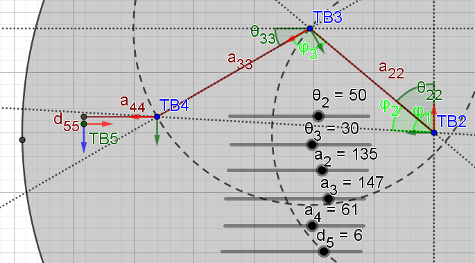

# Robot Kinematics Maths
**This branch is a compilation of personal notes used in the context of robot kinematics and the code used in this GitHub-repository. I am no expert in the field of robot kinematics, so be advised to seek further literatue on the subject.**

# Table of contents

1. [Robot Kinematics, Angle-Set Conventions, and Transform Matrices](https://github.com/SaltworkerMLU/robotKinematicsCatalogue/tree/RobotKinematicsMaths/?tab=readme-ov-file#1-robot-kinematics-angle-set-conventions-and-transform-matrices)

    * [Angle-set Conventions](https://github.com/SaltworkerMLU/robotKinematicsCatalogue/tree/RobotKinematicsMaths/?tab=readme-ov-file#angle-set-conventions)
    * [Transform matrices](https://github.com/SaltworkerMLU/robotKinematicsCatalogue/tree/RobotKinematicsMaths/?tab=readme-ov-file#transform-matrices)

2. [Trajectory Generation](https://github.com/SaltworkerMLU/robotKinematicsCatalogue/tree/RobotKinematicsMaths/?tab=readme-ov-file#2-trajectory-generation)

    * [Interpolated Motion](https://github.com/SaltworkerMLU/robotKinematicsCatalogue/tree/RobotKinematicsMaths/?tab=readme-ov-file#interpolated-motion)
    * [Trajectory Planning](https://github.com/SaltworkerMLU/robotKinematicsCatalogue/tree/RobotKinematicsMaths/?tab=readme-ov-file#trajectory-planning)
    * [Calculating execution time $t_f$](https://github.com/SaltworkerMLU/robotKinematicsCatalogue/tree/RobotKinematicsMaths/?tab=readme-ov-file#calculating-execution-time-t_f)

3. [Forward Kinematics](https://github.com/SaltworkerMLU/robotKinematicsCatalogue/tree/RobotKinematicsMaths/?tab=readme-ov-file#3-forward-kinematics-fk)
4. [Inverse Kinematics](https://github.com/SaltworkerMLU/robotKinematicsCatalogue/tree/RobotKinematicsMaths/?tab=readme-ov-file#4-inverse-kinematics-ik)

    * [SCARA Robots (4DOF)](https://github.com/SaltworkerMLU/robotKinematicsCatalogue/tree/RobotKinematicsMaths/?tab=readme-ov-file#scara-robots-4dof)
    * [Palletizing Robots (4DOF)](https://github.com/SaltworkerMLU/robotKinematicsCatalogue/tree/RobotKinematicsMaths/?tab=readme-ov-file#palletizing-robots-4dof)
    * ["Collaborative" Robots (6DOF)](https://github.com/SaltworkerMLU/robotKinematicsCatalogue/tree/RobotKinematicsMaths/?tab=readme-ov-file#collaborative-robots-6dof)
    * [Industrial Robots (6DOF)](https://github.com/SaltworkerMLU/robotKinematicsCatalogue/tree/RobotKinematicsMaths/?tab=readme-ov-file#industrial-robots-6dof)
    <!-- * 3D Delta Robots (4DOF) -->

5. [Links for further reading](https://github.com/SaltworkerMLU/robotKinematicsCatalogue/tree/RobotKinematicsMaths/?tab=readme-ov-file#5-links-for-further-reading)

# 1. Robot Kinematics, Angle-Set Conventions, and Transform Matrices
This section goes into detail on the methods used in the python file "angleSetConventions.py" and its class "angleSetConventions".

Understanding Robot Kinematcs starts with the idea that any rigid body can move in 6 degrees of freedom (6DOF). A figure depicting said 6DOF is shown below with the dimensions $P = [ x, y, z, R_Z, R_Y, R_X ]^T$.

The position of $P$ can be depicted using the 3 axes vector $P_{xyz} = [ x, y, z ]^T$, while the orientation of $P$ can be depicted using the above 3 angles. For reference, a rotation of the z-axis alone can be depicted as the below matrix:

$$R_Z(θ) = 
\begin{bmatrix} 
    cos(θ) & -sin(θ) & 0 \\ 
    sin(θ) & cos(θ) & 0 \\ 
    0 & 0 & 1 
\end{bmatrix}$$

The position $P$ speficially depicts a ZYX fixed angle representation of orientation. In case another angle representation were to be used, the values of $R_Z$, $R_Y$, and $R_X$ may vary.

## Angle-set Conventions
Any combination of said 3 angles is considered an angle-set convention, provided said combination is able to represent a 3D orientation. In fact, a total of 12 angle sets allow this. 

These angles become fixed angles when representing a rotation of the fixed reference frame (e.g. the reference frame depicted above) and euler angles when representing a rotation of the reference frame relative to each rotation.

For instance, the ZYX fixed angle representation is defined as shown below with each rotation being in relation to the same frame:

$$R_{ZYX}(\alpha, \beta, \gamma) = 
\begin{bmatrix} 
    cos(\gamma) & -sin(\gamma) & 0 \\ 
    sin(\gamma) & cos(\gamma) & 0 \\ 
    0 & 0 & 1 
\end{bmatrix}
\cdot
\begin{bmatrix} 
    cos(\beta) & 0 & sin(\beta) \\ 
    0 & 1 & 0 \\ 
    -sin(\beta) & 0 & cos(\beta) 
\end{bmatrix}
\cdot
\begin{bmatrix} 
   1 & 0 & 0 \\ 
    0 &  cos(\alpha) & -sin(\alpha) \\ 
    0 & sin(\alpha) & cos(\alpha) 
\end{bmatrix}$$

On the other hand, ZYX euler angle representation is defined as shown below:

$$R_{ZY'X''}(\alpha, \beta, \gamma) = 
\begin{bmatrix} 
    cos(\gamma) & -sin(\gamma) & 0 \\ 
    sin(\gamma) & cos(\gamma) & 0 \\ 
    0 & 0 & 1 
\end{bmatrix}
\cdot
\begin{bmatrix} 
    cos(\beta) & 0 & sin(\beta) \\ 
    0 & 1 & 0 \\ 
    -sin(\beta) & 0 & cos(\beta) 
\end{bmatrix}
\cdot
\begin{bmatrix} 
   1 & 0 & 0 \\ 
    0 &  cos(\alpha) & -sin(\alpha) \\ 
    0 & sin(\alpha) & cos(\alpha) 
\end{bmatrix}$$

Note how $R_Y$ rotates into $R_{Y'}$ after having been rotated by $R_Z$, while $R_X$ rotates into $R_{X''}$ after having been rotated by $R_Z$ and $R_{Y'}$.

## Transform matrices
In algebraic terms, a rotation matrix ${^B_A R}$ is able to rotate a vector ${^A P}$ into the vector ${^B P}$. This means the rotation matrix alone cannot move any vector to another position. To do this, a seperate vector ${^B P}_{AORG}$ must be added to the expression. When doing so, $^A P$ is transformed to $^B P$, meaning it is both rotated and moved/translated to the desired position, which looks like this:

$${^B_A R} \cdot {^A P} + {^B P}_{AORG} = $$

$$\begin{bmatrix} 
    {^B_A R} & {^B P}_{AORG} \\
     0 \text{ } 0 \text{ } 0 & 1
\end{bmatrix}
\cdot 
\begin{bmatrix}
    {^A P} \\
    1
\end{bmatrix} = {^B_A T} \cdot 
\begin{bmatrix}
    {^A P} \\
    1
\end{bmatrix} = 
\begin{bmatrix} ^B P \\ 1 \end{bmatrix}$$

The matrix ${^B_A T}$ is what is known as a (homogenous) transform matrix. It allows a 6DOF position $P$ to be converted into a matrix format and any such transform matrix to be converted into a 6DOF position. For future reference, the elements of the transform matrix are accessed using the following definition:

$$T = 
\begin{bmatrix} 
    T_{11} & T_{12} & T_{13} & T_x \\
    T_{21} & T_{22} & T_{23} & T_y \\
    T_{31} & T_{32} & T_{33} & T_z \\
    0 & 0 & 0 & 1 \\
\end{bmatrix}$$

Furthermore, it allows multiple transform matrices to undergo matrix multiplication to form more sophisticated transform matrices depicting more advanced systems. And transform matrices can even be inverted.

${^A_C T} = {^A_\mathbf{B} T} \cdot {^\mathbf{B}_C T} = {^\mathbf{B}_A T}^{-1} \cdot {^\mathbf{B}_C T}$

# 2. Trajectory Generation
Consider a start position $P_S$ and end position $P_E$ of a rigid body. To move from $P_S$ to $P_E$, a trajectory must be generated, hence the term "trajectory generation". 

Such a trajectory is defined by the path it takes to get between positions (the Interpolated Motion) and the mathematical function describing the trajectory between positions (the Trajectory Planning).

## Interpolated Motion
Any motion the robotic arm makes use of interpolation to navigate between positions $P_S$ and $P_E$. 
Such interpolation can be done in several ways. Two common methods of interpolation are:
- **Joint motion moveJ():** Interpolation using 6DOF representation
- **Linear motion moveL():** Interpolation using equivalent angle axis representation

### Joint motion
Using the joint values $θ_S$ and $θ_E$ a joint motion, using each joint independently of one another, can be made. The idea is to have each joint of a robotic arm follow their seperate trajectories between two points.

$$\text{moveJ}(t) = \begin{bmatrix} θ_{1}(t) & ... & θ_{n}(t) \end{bmatrix}^T $$

Using such a joint motion to go from $P_S$ to $P_E$ requires that these positions can be represented using the joints of the robotic arm. This can be done by using Inverse Kinematics on said positions converting them into joint values.

$$θ_S = \begin{bmatrix} θ_{1,S} & ... & θ_{n,S} \end{bmatrix}^T  = \begin{matrix}
    \text{IK} \begin{pmatrix} P_S\end{pmatrix} &&&
    θ_E = \begin{bmatrix} θ_{1,E} & ... & θ_{n,E} \end{bmatrix}^T  = \text{IK} \begin{pmatrix} P_E \end{pmatrix}
\end{matrix}$$

### Linear motion
Provided the position $P_S$ and $P_E$ in transform matrix format ${^B_S T}$ and ${^B_E T}$, it becomes possible to make a single transform matrix able to represent a linear motion between the two points ${^S_E T} = {^B_S T}^{-1} \cdot {^B_E T}$. And in cases where only joint values are provided, Forward Kinematics can be used to get said positions.

$$P_S = \begin{matrix}
\text{FK} \begin{pmatrix} \begin{bmatrix} θ_{1,S} & ... & θ_{n,S} \end{bmatrix}^T \end{pmatrix} &&&
P_E = \text{FK} \begin{pmatrix} \begin{bmatrix} θ_{1,E} & ... & θ_{n,E} \end{bmatrix}^T \end{pmatrix}
\end{matrix}$$

Using ${^S_E T}$, a linear motion between $P_S$ and $P_E$ becomes plausible using an angle-axis representation defined as:

$$\text{moveL}(t) = \begin{bmatrix} x(t) & y(t) & x(t) & θ(t)\end{bmatrix}^T$$

Where 

$$\begin{matrix} 
    x(t) = {^S_E T_x}, & 
    y(t) = {^S_E T_y}, & 
    z(t) = {^S_E T_z}, & 
    θ(t) = \frac{cos^{-1} ({^S_E T_{11}} + {^S_E T_{22}} + {^S_E T_{33}} - 1)}{2}
\end{matrix}$$

Do note that a rotation matrix representation of $θ$ can be made using the below equation:

$${^S_E R} = 
\begin{bmatrix} 
    k_x \cdot k_x \cdot (1 - \text{cos}θ) + \text{cos}θ & 
    k_x \cdot k_y \cdot (1 - \text{cos}θ) - k_z \cdot \text{sin}θ & 
    k_x \cdot k_z \cdot (1 - \text{cos}θ) + k_y \cdot \text{sin}θ \\
    k_y \cdot k_x \cdot (1 - \text{cos}θ) + k_z \cdot \text{sin}θ & 
    k_y \cdot k_y \cdot (1 - \text{cos}θ) + \text{cos}θ & 
    k_y \cdot k_z \cdot (1 - \text{cos}θ) - k_x \cdot \text{sin}θ \\
    k_z \cdot k_x \cdot (1 - \text{cos}θ) - k_y \cdot \text{sin}θ & 
    k_z \cdot k_y \cdot (1 - \text{cos}θ) + k_x \cdot \text{sin}θ & 
    k_z \cdot k_z \cdot (1 - \text{cos}θ) + \text{cos}θ
\end{bmatrix}$$

Where

$$K = 
\begin{bmatrix} k_x \\ k_y \\ k_z \end{bmatrix} =
\frac{1}{2 \cdot \text{sin}(θ)} 
\cdot 
\begin{bmatrix} 
    {^S_E T_{32}} - {^S_E T_{23}} \\
    {^S_E T_{13}} - {^S_E T_{31}} \\
    {^S_E T_{21}} - {^S_E T_{12}}
\end{bmatrix}$$

## Trajectory Planning
This section goes into detail on the theory behind the methods used in the python file "trajectoryGeneration.py" and its class "trajectoryGeneration".

The trajectory planner of any robotic arm can be set to run in a meriat of ways. In this repository, two such trajectory planners have been used.
- **Cubic Polynomial**
- **Parabolic Blend** aka. Linear Segments with Parabolic Blend (LSPB)

Note that for any joint or DOF over time $θ(t)$, movement between 2 positions may be described using these 4 constraints:

- $θ(0) = θ_0$
- $θ(f) = θ_f$
- $\dot{θ}(0) = \dot{θ}_0$
- $\dot{θ}(f) = \dot{θ}_f$

### Cubic Polynomial
  

IMAGE SOURCE: [1]

The 4 contraints described above may be satisfied using a cubic polynomial such as the one seen below:

$$\begin{matrix} θ(t) = a_0 + a_1 \cdot t + a_2 \cdot t^2 + a_3 \cdot t^3 &\text{, where } t \in [0, t_f] \end{matrix}$$

Using this cubic polynomial, the velocity of the trajectory can be found as its derivarive $\dot{θ}(t)$ and the acceleration as the second derivative $\ddot{θ}(t)$.

$$\begin{matrix} 
    \dot{θ}(t) = a_1 + 2  a_2 \cdot t + 3  a_3 \cdot t^2 & \text{, where } t \in [0, t_f] \\
    \ddot{θ}(t) = 2 a_2 + 6  a_3 \cdot t & \text{, where } t \in [0, t_f]
\end{matrix}$$

Using $θ(t)$ and $\dot{θ}(t)$, the 4 constraints can be expressed as the following equations:

- $θ(0) = a_0$
- $θ(f) = a_0 + a_1 \cdot t_f + a_2 \cdot t_f^2 + a_3 \cdot t_f^3$
- $\dot{θ}(0) = a_1$
- $\dot{θ}(f) = a_1 + 2  a_2 \cdot t + 3  a_3 \cdot t^2$

Solving for the parameters $a_0$, $a_1$, $a_2$, and $a_3$ using the above 4 expressions, the following equations are obtained:

- $a_0 = θ(0)$
- $a_1 = \dot{θ}(0)$
- $a_2 = \frac{3}{t_f^2} \cdot (θ_f - θ_0) - \frac{2}{t_f} \cdot \dot{θ} - \frac{1}{t_f} \cdot \dot{{θ}}_f$
- $a_3 = -\frac{2}{t_f^3} \cdot (θ_f - θ_0) + \frac{1}{t_f^2} \cdot (\dot{θ}_0 + \dot{θ}_f)$

Assuming the robotic arm has $n$ joints, a matrix-vector equation can be established to describe the cubic polynomial of each of these joints:

$$\text{moveJ}(t) = \begin{bmatrix} 
    a_{1,0} & a_{1,1} & a_{1,2} & a_{1,3} \\
    ... & ... & ... & ... \\
    a_{n,0} & a_{n,1} & a_{n,2} & a_{n,3} \\
\end{bmatrix} 
\cdot 
\begin{bmatrix} 1 & t & t^2 & t^3 \end{bmatrix}^T \text{, for n joints} $$

### Linear Segments with Parabolic Blend  (LSPB)

IMAGE SOURCE: [1]

The parabolic blend is derived using the 3 Kinematics Equations in terms of rotation $θ(t)$

$$\begin{matrix}
    θ(t) = & \frac{1}{2} \ddot{θ} \cdot t^2 + \dot{θ}_0 \cdot t + θ_0 \\
    \dot{θ}(t) = & \ddot{θ} \cdot t + \dot{θ}_0 \\
    \dot{θ}(t)^2 = & \dot{θ}^2_0 + 2 \ddot{θ} \cdot (θ_f - θ_0)
\end{matrix}$$

Using the 4 constraints mentioned above, these 3 Kinematics Equations wind up like this:

$$\begin{matrix} 
    θ(t) = & \frac{1}{2} \ddot{θ} \cdot t^2 + θ_0 \\
    \dot{θ}(t) = & \ddot{θ} \cdot t \\
    \dot{θ}(t)^2 = & 2 \ddot{θ} \cdot (θ_f - θ_0)
\end{matrix}$$

Using these 3 equations, the 3 segments of the Parabolic Blend can be defined as:

$$θ(t) = \begin{Bmatrix} 
    \begin{matrix} θ_0 + \frac{1}{2} \ddot{θ} \cdot t^2, & \text{if } t_0 \leq t \leq t_b \\
    θ_b + a \cdot t_b \cdot (t - t_b),  & \text{if } t_b < t < t_f - t_b \\
    θ_f - \frac{1}{2} \ddot{θ} \cdot t^2 + θ_0,  & \text{if } t_f - t_b \leq t \leq t_f \end{matrix}
\end{Bmatrix} \text{, for} \begin{bmatrix} t_0, t_f \end{bmatrix} $$

Where

$$t_b = \frac{t_f}{2} - \text{abs} \begin{pmatrix} \sqrt{ \frac{\ddot{θ}^2 \cdot t_f^2 - 4 \cdot \ddot{θ} \cdot (Pe-Ps) }{(2 \cdot \ddot{θ})}} \end{pmatrix}$$

The parabolic blend comes with its own condition, because it has to comply with the 3 Kinematic Equations. Using the third Kinematic Equation, this condition can be derived assuming no overlap occurs between the 3 segments meaning, $t_f \geq 2 t_b$ must be true:

$$ \dot{θ}(t_b)^2 = 2 \ddot{θ} \cdot (θ_f - θ_0) \to 
\dot{θ}(t_f)^2 \geq 4 \ddot{θ} \cdot (θ_f - θ_0) \to
(\ddot{θ} \cdot t_f)^2 \geq 4 \ddot{θ} \cdot (θ_f - θ_0) \to 
\ddot{θ} \geq \frac{4 \cdot (θ_f - θ_0)}{t_f^2}$$

## Calculating execution time $t_f$

The used method of calculating execution time $t_f$ of any trajectory makes use of the assumption that a parabolic blend is used. 

Consider that the Parabolic Blend has a maximum velocity $v_{max}$ and maximum acceleration ${a_{max}}$. This means the Parabolic Blend has a velocity of $v_{max}$ during its linear segment and an acceleration of $a_{max}$ during acceleration (negative $a_{max}$ during deceleration). This way, the time $t_b$ becomes equal to:

$$ t_b = v_{max} / a_{max} $$

Using $t_b$, it becomes possible to determine the execution time $t_f$. In cases where $2 t_b = t_f$, $t_f$ becomes:

$$ \begin{matrix} 
    t_f = \sqrt{ \frac{4 \cdot (θ_f - θ_0)}{a_{max}} } & \text{, if } 2 t_b \geq t_f 
\end{matrix} $$

Note how even though the expression $2 t_b > t_f$ is theoretically implausible, it accounts for cases when the specified $v_{max}$ surpases the maximum reached velocity of the specified Parabolic Blend.

On the other hand, when $2 t_b < t_f$, the linear segment has to be taken into account. This is done by using the below expression:

$$ \begin{matrix} 
    t_f = t_b + \frac{θ_f - θ_0}{v_{max}} & \text{, if } 2 t_b < t_f 
\end{matrix} $$

Using the two above equation describing execution time $t_f$, the theoretically lowest $t_f$ is acquired assuming the specified $v_{max}$ and $a_{max}$ apply to the trajectory. That is to say these equations assume a parabolic blend is used as the trajectory planner.

# 3. Forward Kinematics (FK)
This section goes into detail on the theory behind the methods used in the python file "forwardKinematics.py" and its class "forwardKinematics".

To map the wrist of any robotic arm, its position relative to its base must be found. This is done using Forward Kinematics. Forward Kinematics converts the joint values of a robotic arm into a transform matrix ${^B_W T}$, effectively mapping a joint space in cartesian space.

Acquiring the transform matrix ${^B_W T}$ is done by using the relation between each joint of a robotic arm. The figure below depicts a transformation between two joints $^{i-1}_i T$.

IMAGE SOURCE: [1]

This repository makes use of Modified Denavit-Hartenberg (DHM) Parameters to describe the transformation between each joint of a robotic arm. DHM-parameters consist of 4 parameters describing a jump between frames/joints: 
- Euler angle of the x-axis $α_{i-1}$
- Length along the x-axis $a_{i-1}$
- Length along the z-axis $d_i$
- Euler angle of the z-axis $θ_{i-1}$

These specified DHM-parameters are used in the equation shown below to define any transform matrix $^{i-1}_i T=$

$$
\begin{bmatrix}
    1 & 0 & 0 & 0 \\
    0 & \cos(\alpha_{i-1}) & -\sin(\alpha_{i-1}) & 0 \\
    0 & \sin(\alpha_{i-1}) & \cos(\alpha_{i-1}) & 0 \\
    0 & 0 & 0 & 1
\end{bmatrix}
\cdot
\begin{bmatrix}
    1 & 0 & 0 & a_{i-1} \\
    0 & 1 & 0 & 0 \\
    0 & 0 & 1 & 0 \\
    0 & 0 & 0 & 1
\end{bmatrix}
\cdot
\begin{bmatrix}
    \cos(θ_i) & -\sin(θ_i) & 0 & 0 \\
    \sin(θ_i) & \cos(θ_i) & 0 & 0 \\
    0 & 0 & 1 & 0 \\
    0 & 0 & 0 & 1
\end{bmatrix}
\cdot
\begin{bmatrix}
    1 & 0 & 0 & 0 \\
    0 & 1 & 0 & 0 \\
    0 & 0 & 1 & d_i \\
    0 & 0 & 0 & 1
\end{bmatrix}$$

$$= 
\begin{bmatrix}
    \cos(θ_i) & -\sin(θ_i) & 0 & a_{i-1} \\
    \sin(θ_i) \cdot \cos(\alpha_{i-1}) & \cos(θ_i) \cdot \cos(\alpha_{i-1}) & -\sin(\alpha_{i-1}) & -\sin(\alpha_{i-1}) \cdot d_i \\
    \sin(θ_i) \cdot \sin(\alpha_{i-1}) & \cos(θ_i) \cdot \sin(\alpha_{i-1}) & \cos(\alpha_{i-1}) & \cos(\alpha_{i-1}) \cdot d_i \\
    0 & 0 & 0 & 1
\end{bmatrix}$$

The DHM-parameters of entire robotic arms are annotated using a DHM-table as the one shown below:

__i__ | $α_{i-1}$ | $a_{i-1}$ | $d_i$ | $θ_i$
--- | --- | --- | --- | ---
**1** | $α_0$ | $a_0$ | $d_1$ | $θ_1$
**2** | $α_1$ | $a_1$ | $d_2$ | $θ_2$
...
**n** | $α_{n-1}$ | $a_{n-1}$ | $d_n$ | $θ_n$

After having acquired the transform matrices, using DHM-parameters, nessecary to do forward kinematics of a robotic arm, the next step is to multiply the transform matrices together to form the transform matrix ${^B_W T}$.

$$ {^B_W T} = {^B_1 T} \cdot {^1_2 T} \cdot ... \cdot {^{n-1}_W T} $$

Note how the transform matrix using the first row of DHM-parameters ${^B_1 T}$ skips the frame \{0\} and the last row ${^{n-1}_W T}$ skips the frame \{n\}. 

Another thing to note is that although a specific robotic arm may have a preset of DHM-parameters, ${^B_W T}$ may be further converted to be in relation to another base frame or even another wrist. In fact, in most real world application, robotic arms have an end-effector mounted to its wrist. 

In case an end-effector is mounted onto a robotic arm, the transform matrix from base to end-effector ${^B_{EE} T}$ may be found  using the equation: 

${^B_{EE} T} = {^B_W T} \cdot {^W_{EE} T}$, where EE is the end-effector of the robotic arm

# 4. Inverse Kinematics (IK)

Inverse Kinematics converts a transform matrix into joint values - Cartesian space to joint space - for a specific robotic arm. And compared to Forward Kinematics, Inverse Kinematics is not as intuitively derived. 

Because this section deals with closed-form solutions, each type of robotic arm has to be evaluated seperately to make for effective Inverse Kinematics. Here is a list of the types of robotic arms which have been taken into consideration in this repository:

- SCARA Robots (4DOF)
- Palletizing Robots (4DOF)
- "Collaborative" Robots (6DOF)
- Industrial Robots (6DOF)
<!-- - 3D Delta Robots (4DOF) -->

*If this is your first time hearing of the term "Inverse Kinematics", it is wise to read from start to end as the most simple Inverse Kinematic Solutions come first and the most advanced come last.*

## SCARA Robots (4DOF)
 

The SCARA Robot is a RRPR-robot using a translational third joint while the rest are rotational joints. Such robots work within the 4DOF $[x, y, z, Rz]^T$ using the joints $[θ 1, θ 2, d 3, θ 4]$.

***SCARA Robots with the translational joint elsewhere has also been accounted for in the code, but for simplicity, only the above type of SCARA Robot will be used as an example.***

DHM-parameters:

__i__ | $α_{i-1}$ | $a_{i-1}$ | $d_i$ | $θ_i$
--- | --- | --- | --- | ---
**1** | 0 | 0 | 0 | $θ1$
**2** | 0 | $a_1$ | 0 | $θ2$
**3** | 0 | $a_2$ | $d_3 + d3$ | 0
**4** | $\pi$ | 0 | 0 | $θ4$

By multiplying the transform matrices depicting each jump between joints, the Forward Kinematics of the SCARA Robot is found to be:

$${^B_W T} = 
\begin{bmatrix} 
    \cos(θ 1 + θ 2 - θ 4) & \sin(θ 1 + θ 2 - θ 4) & 0 & a_1 \cdot \sin(θ 1) + a_2 \cdot \cos(θ 1 + θ 2) \\
    \sin(θ 1 + θ 2 - θ 4) & -\cos(θ 1 + θ 2 - θ 4) & 0 & a_1 \cdot \cos(θ 1) + a_2 \cdot \sin(θ 1 + θ 2) \\
    0 & 0 & -1 & d3 + d_3 \\
    0 & 0 & 0 & 1
\end{bmatrix}$$

Upon inspection of ${^B_W T}$, it becomes evident that it may be formulated like this:

$${^B_W T} = 
\begin{bmatrix}
    R_Z(θ 1 + θ 2 - θ 4) \cdot R_X(\pi) & 
    \begin{bmatrix}
        a_1 \cdot \sin(θ 1) + a_2 \cdot \cos(θ 1 + θ 2) \\
        a_1 \cdot \cos(θ 1) + a_2 \cdot \sin(θ 1 + θ 2) \\
        d_3 + d3
    \end{bmatrix} \\
    \begin{bmatrix} 
        0 & 0 & 0 
    \end{bmatrix} & 1
\end{bmatrix}$$

By observing ${^B_W T}$ in this format, deriving a closed-form Inverse Kinematic Solution will be done by decoupling the transform matrix into the following set of equations:

$$\begin{Bmatrix} 
    {^B_W T_x} = & a_1 \cdot \sin(θ 1) + a_2 \cdot \cos(θ 1 + θ 2) \\
    {^B_W T_y} = & a_1 \cdot \cos(θ 1) + a_2 \cdot \sin(θ 1 + θ 2) \\
    {^B_W T_z} = & d_3 - d3 \\
    {^B_W R} = & R_Z(θ 1 + θ 2 - θ 4) \cdot R_X(\pi)
\end{Bmatrix}$$

This system of equations allow the Inverse Kinematics to be derived using an Algebraic Solution.

### Finding $θ 1$ and $θ 2$
The elements ${^B_W T_x}$ and ${^B_W T_y}$ depend on the two joints $θ_1$ and $θ_2$.

$$\begin{Bmatrix} 
    {^B_W T_x} = & a_1 \cdot \sin(θ 1) + a_2 \cdot \cos(θ 1 + θ 2) \\
    {^B_W T_y} = & a_1 \cdot \cos(θ 1) + a_2 \cdot \sin(θ 1 + θ 2)
\end{Bmatrix}$$

And because the SCARA robot only rotates around its own z-axis, as depicted by ${^B_W T}$ the SCARA robot keeps its rotations on an XY-plane. Thus, $θ_1$ and $θ_2$ can be plotted as shown below:

 

Note how the transform matrix ${^B_3 T}$ has the same x- and y-coordinates as ${^B_W T}$ because $d3$ and $θ_4$ have no impact on said coordinates.

Finding $θ_2$ may intuitively be done geometrically by using the Law of Cosine using the figures above, but in this case, the Algebraic approach will be taken. Using the expression ${^B_W T_x}^2 + {^B_W T_y}^2$, the following expression is found:

$$\begin{matrix}
    {^B_W T_x}^2 + {^B_W T_y}^2 = & (a_1 \cdot \sin(θ 1) + a_2 \cdot \cos(θ 1 + θ 2))^2 + (a_1 \cdot \cos(θ 1) + a_2 \cdot \sin(θ 1 + θ 2))^2 \\
    ... \\
    {^B_W T_x}^2 + {^B_W T_y}^2 = & a_1^2 + a_2^2 + 2 \cdot a_1 \cdot a_2 \cdot \cos(θ2) \\
    \cos(θ2) = &  \frac{{^B_W T_x}^2 + {^B_W T_y}^2 - a_1^2 - a_2^2}{2 \cdot a_1 \cdot a_2} \\
    θ 2 = & \pm \cos^{-1} \begin{pmatrix} \frac{ {^0_4 T_x}^2 + {^1_4 T_x}^2 - a_1^2 - a_2^2 }{2 \cdot a_1 \cdot a_2} \end{pmatrix}
\end{matrix}$$

Note how $θ 2$ has two unique solutions which both may be used as an Inverse Kinematics Solution. Both will be included.

Finding $θ 1$ will be done using the following theorem:

For a system of equations 

$$\begin{matrix} 
    C_1 \cdot \cos(θ_i) + C_2 \cdot \sin(θ_i) + C_3 = 0 \\
    C_1 \cdot \sin(θ_i) - C_2 \cdot \cos(θ_i) + C_4 = 0
\end{matrix}$$

The solution is:

$$ θ_i = \text{atan2}( -C_1 \cdot C_4 - C_2 \cdot C_3, C_2 \cdot C_4 - C_1 \cdot C_3 )$$

Proving the following theorem is beyond the scope of this repository. Instead, the constants used in the context of the SCARA robot have been provided below:

$$\begin{matrix} 
    C1 = & a_1 + a_2 \cdot \cos(θ_2) \\
    C2 = & -a_2 \cdot \sin(θ_2) \\
    C3 = & -{^0_4 T_x}\\
    C4 = & -{^0_4 T_y}
\end{matrix}$$

### Finding $d3$ and $θ_4$
By looking at the last two equations describing ${^B_W T}$:

$$\begin{Bmatrix}     
    {^B_W T_z} = & d3 + d_3 \\
    {^B_W R} = & R_Z(θ 1 + θ 2 - θ 4) \cdot R_X(\pi)
\end{Bmatrix}$$

Finding $d3$ becomes trivially easy to do. As for finding $θ 4$, it all boils down to the idea that the joint, as well as $θ 1$ and $θ 2$, can be considered both euler angles relative to their own respective frames and fixed angles of $R_Z$ relative to the global frame ${^B_W T}$. 

In other words: $θ 1$, $θ 2$, and $θ 4$ only ever rotate around the z-axis of ${^B_W T}$. Thus, assuming the SCARA has the 6DOF position $[ x, y, z, R_Z, 0, \pi ]$, using an ZYX fixed angle representation, the following expression can be made:

$$R_Z = θ 1 + θ 2 - θ 4$$

Note how using another Angle-Set Convention could make the result skewed. 

### The closed-form Inverse Kinematic Solution

$$\begin{Bmatrix} 
    θ 1 = & \text{atan2}( -C1 \cdot C4 - C2 \cdot C3, C2 \cdot C4 - C1 \cdot C3 ) \\
    θ 2 = & \pm \cos^{-1} \begin{pmatrix} \frac{ {^0_4 T_x}^2 + {^1_4 T_x}^2 - a_1^2 - a_2^2 }{2 \cdot a_1 \cdot a_2} \end{pmatrix} \\
    d3 = & {^B_W T_z} - d 3 \\
    θ 4 = & θ 1 + θ 2 - R_z
\end{Bmatrix}$$

To conclude, the SCARA robot has up to 2 unique Inverse Kinematic Solutions assuming ${^B_W T}$ is within the workspace of the SCARA robot.

$$\begin{bmatrix} 
     θ 1 & θ 2 & θ 3 & θ 4 \\
     ... & + & ... & ... \\
     ... & - & ... & ...
\end{bmatrix}$$

As can be seen in the python file "robotKinematics/inverseKinematics/__4DOF/SCARARobot.py", there has been accounted for Inverse Kinematics Solutions where $θ 4$ can be rotated 360 degrees in either direction, using any of the solutions to form another one, effectively making it plausible to have up to 4 Inverse Kinematic Solutions. This has not been done using $θ 1$ and $θ 2$, as it is assumed they both stay within the range $[-\pi, \pi]$.

## Palletizing Robots (4DOF)

 

Palletizing robots are 4xR robots with 4 rotational joints. Such robots work within the 4DOF $[x, y, z, Rz]^T$ using the joints $[θ 1, θ 2, θ 3, θ 4]$.

DHM-parameters

__i__ | $α_{i-1}$ | $a_{i-1}$ | $d_i$ | $θ_i$ ||| __i__ | $α_{i-1}$ | $a_{i-1}$ | $d_i$ | $θ_i$
--- | - | - | - | -  | -| -             | - | - | - | - | -
**1** | 0 | 0 | $d_1$ | $θ1$              ||| **1** | 0 | 0 | $d_1$ | $θ1$
**2** | $-\frac{\pi}{2}$ | $a_1$ | 0 | $θ2 - \frac{\pi}{2}$       ||| **2** | $-\frac{\pi}{2}$ | $a_1$ | 0 | $θ2$
**3** | 0 | $a_2$ | 0 | $θ3 + \frac{\pi}{2} - θ2$         ||| **3** | 0 | $a_2$ | 0 | $θ3$
**4** | 0 | $a_3$ | 0 | $-θ3$              ||| **4** | 0 | $a_3$ | 0 | $-θ2-θ3$
**5** | $-\frac{\pi}{2}$ | $a_4$ | $d_5$ |  $θ 4 + θ_4$              ||| **5** | $-\frac{\pi}{2}$ | $a_4$ | $d_5$ |  $θ 4 + θ_4$

Do not be intimidated by the negative joint values. They simply imply that said joints cancel out at the specified segment. In mathematical terms, this means the following expression is used to define e.g. ${^2_3 T}$ when $θ_i = θ 3 + \frac{\pi}{2} - θ 2$:

$$ {^2_3 T} = 
\begin{bmatrix}
    1 & 0 & 0 & a_2 \\
    0 & 1 & 0 & 0 \\
    0 & 0 & 1 & 0 \\
    0 & 0 & 0 & 1
\end{bmatrix}
\cdot
\begin{bmatrix} 
    \cos(θ 3 + \frac{\pi}{2} - θ 2) & -\sin(θ 3 + \frac{\pi}{2} - θ 2) & 0 & 0 \\
    \sin(θ 3 + \frac{\pi}{2} - θ 2) & \cos(θ 3 + \frac{\pi}{2} - θ 2) & 0 & 0 \\
    0 & 0 & 1 & 0 \\
    0 & 0 & 0 & 1
\end{bmatrix}$$

Note how two types of palletizing robots exist as shown with the 2 DHM-tables above. The difference between these 2 subtypes of palletizing robots however, is not only the DHM-parameters shown above.

By multiplying the transform matrices depicting each jump between joints, the Forward Kinematics of the palletizing Robot ${^B_W T}$ is found to be a transform matrix so large that it will not be shown here. Instead, the Inverse Kinematics will be (mostly) derived geometrically.

### Finding $θ 1$
Starting off, the transform matrix ${^B_W T}$ will be decoupled into ${^B_5 T}$ to take care of any gripper upon the robot:

$${^B_5 T}={^B_W T} \cdot {^5_W T}^{-1}$$

Using ${^B_5 T}$, it turns out that the direction the robot is facing solely depends on $θ 1$ as shown in the figure below: 

 

Because of this, $θ 1$ can be found as the inverse tangent of the adjacent ${^B_5 T_y}$ and the opposite ${^B_5 T_x}$. And to take into account all $360 \degree$ around the robot, atan2 is used:

$$θ 1 = \text{atan2}({^B_5 T_y}, {^B_5 T_x})$$

### Finding $θ 4$
The gimmick to finding $θ 4$ lies in the understanding that $θ 2$ and $θ 3$ cancel out as shown in the DHM-parameters. Because of this, the orientation of ${^B_W T}$ can be simplified to the following format:

$${^B_W R} = R_z(θ 1) \cdot R_x(-\pi) \cdot R_z(θ 4 + θ_4)$$

Which it turns out is equal to:

$${^B_W R} = R_x(-\pi) \cdot R_z(-θ 1 + θ 4 + θ_4)$$

Using $R_z$ alone, assuming a XYZ euler angle set is used, the equation for $θ 4$ becomes:

$$R_z = -θ 1 + θ 4 + \pi \to θ 4 = R_z + θ 1 - θ_4$$

### Finding $θ 2$ and $θ 3$
Having found $θ 1$ and $θ 4$, the transform matrix ${^B_5 T}$ can be found decoupled into ${^1_4 T}$:

$$ {^1_4 T} = ({^0_1 T} \cdot {^1_2 T})^{-1} \cdot {^B_5 T} \cdot {^4_5 T}^{-1} $$

The gimmick to taking care of $a_1$ lies in finding ${^2_4 T}$, assuming $θ 2 = 0$

$$ {^2_4 T} = {^1_2 T}^{-1} \cdot {^1_4 T} $$

Doing so allows ${^2_4 T}$, to form a triangle which can be shaped as shown in the figure below:

 

Notice how the frame of ${^B_2 T}$ is not rotated along $\theta 2$. This allows $\phi_1$ to be found as the angle between ${^2_4 T}$ and its own x-axis:

$$\phi_1 = \cos^{-1} \begin{pmatrix} {^2_4 T_x} / \sqrt{{^2_4 T_x}^2 + {^2_4 T_y}^2} \end{pmatrix}$$

Using the Law of Cosine, $\phi_2$ is found as:

$$\phi_2 = \pm \cos^{-1}\begin{pmatrix} ({^2_4 T_x}^2 + {^2_4 T_y}^2 + a_2^2 - a_3^2) / (2 \cdot \sqrt{{^2_4 T_x}^2 + {^2_4 T_y}^2} \cdot a_2) \end{pmatrix}$$

$$θ 2 = \phi_1 \pm \phi_2 - \frac{\pi}{2} - θ_2$$

The expression $ - \frac{\pi}{2} - θ_2$ is used to make the equation compatible with both types of palletizing robots.

Using the figure above, $\theta_3$ is found as:

$$θ 3 = \pm \phi_3 + θ_4$$

Where $\phi_3$ is found using the Law of Cosine (again):

$$\phi_3 = \pm \cos^{-1}\begin{pmatrix} (-{^2_4 T_x}^2 - {^2_4 T_y}^2 + a_2^2 + a_3^2) / (2 \cdot a_2 \cdot a_3) \end{pmatrix}$$

If $θ 2$ cancels out a $i=3$

$$θ 3 \mathrel{+}= θ 2 - \frac{\pi}{2}$$

### The closed-form Inverse Kinematic Solution
$$\begin{Bmatrix} 
    θ 1 = & \text{atan2}({^0_4 T_y}, {^0_4 T_x}) \\
    θ 2 = & \phi_1 \pm \phi_2 - \frac{\pi}{2} - θ_2 \\
    θ 3 = & \pm \phi_3 + θ_4 \\
    θ 4 = & R_z + θ 1 - θ_4
\end{Bmatrix}
\text{, if } θ_2 \text{ cancels out at }i=3 \to θ 3 \mathrel{+}= θ 2 - \frac{\pi}{2}$$

To conclude, the palletizing has 2 unique Inverse Kinematics Solutions in the format shown below:

$$\begin{bmatrix} 
     θ 1 & θ 2 & θ 3 & θ 4 \\
     ... & - & + & ... \\
     ... & + & - & ...
\end{bmatrix}$$

The inverse Kinematics used for any palletizing robot can be found in the python file "robotKinematics/inverseKinematics/__4DOF/palletizingRobot.py". Do note that although 2 unique Inverse Kinematic Solutions are available, more often than not, only one of them generally proves suffificent to use. Below, another Inverse Kinematic Solution to the above image can be seen.

 

This trend continues with basically any other palletizing robot. But again, it is not in all poses that only 1 sufficient Inverse Kinematic Solution may be used.

## "Collaborative" Robots (6DOF)

 

A "collaborative" robot is a 6xR robot with 6 rotational joints. Such robots work within the 6DOF $[x, y, z, Rz, Ry, Rx]^T$ (angle-set convention may vary) using the joints $[θ 1, θ 2, θ 3, θ 4, θ 5, θ 6]$.

*To clear any misunderstandings, what is meant by a "collaborative robot" is, in this instance, is a robot with the DHM-parameters seen below.*

__i__ | $α_{i-1}$ | $a_{i-1}$ | $d_i$ | $θ_i$
--- | --- | --- | --- | ---
**1** | 0 | 0 | $d_1$ | $θ1$
**2** | $\pi/2$ | 0 | 0 | $θ2 + θ_2$
**3** | 0 | $a_2$ | 0 | $θ3$
**4** | 0 | $a_3$ | $d_4$ | $θ4 + θ_4$
**5** | $-\pi/2$ | 0 | $d_5$ | $θ5$
**6** | $\pi/2$ | 0 | $d_6$ | $θ6 + θ_6$

Due to the complexity of the transform matrix ${^B_W T}$  obtained using Forward Kinematics, the Inverse Kinematics will be derived using a (mostly) geometrically obtained Inverse Kinematics Solution.

### From $^B_W T$ to $^0_6 T$
The transform matrix ${^B_W T}$ can be decoupled to the transform matrix ${^0_6 T}$ to isolate the DHM-parameters $d_1$, $d_6$, and $θ_6$. 

$${^0_6 T} = {^B_0 T}^{-1} \cdot {^B_W T} \cdot {^6_W T}^{-1} = 
\begin{bmatrix} 
    1 & 0 & 0 & 0 \\
    0 & 1 & 0 & 0 \\
    0 & 0 & 1 & d_1 \\
    0 & 0 & 0 & 1 \\ 
\end{bmatrix}^{-1}
\cdot
{^B_W T}
\cdot
\begin{bmatrix} 
    \cos(θ_6) & -\sin(θ_6) & 0 & 0 \\
    \sin(θ_6) & \cos(θ_6) & 0 & 0 \\
    0 & 0 & 1 & 0 \\
    0 & 0 & 0 & 1 \\ 
\end{bmatrix}^{-1}
$$

Inverting ${^B_0 T}$ and ${^6_W T}$ works out rather well as seen below.

$${^0_6 T} = {^0_B T} \cdot {^B_W T} \cdot {^W_6 T} = 
\begin{bmatrix} 
    1 & 0 & 0 & 0 \\
    0 & 1 & 0 & 0 \\
    0 & 0 & 1 & -d_1 \\
    0 & 0 & 0 & 1 \\ 
\end{bmatrix}
\cdot
{^B_W T}
\cdot
\begin{bmatrix} 
    \cos(θ_6) & \sin(θ_6) & 0 & 0 \\
    -\sin(θ_6) & \cos(θ_6) & 0 & 0 \\
    0 & 0 & 1 & 0 \\
    0 & 0 & 0 & 1 \\ 
\end{bmatrix}
$$

The transform matrix ${^0_6 T}$ is equivalent to finding the Inverse Kinematic Solution using the DHM-parameters seen below:

__i__ | $α_{i-1}$ | $a_{i-1}$ | $d_i$ | $θ_i$
--- | --- | --- | --- | ---
**1** | 0 | 0 | 0 | $θ1$
**2** | $\pi/2$ | 0 | 0 | $θ2 + θ_2$
**3** | 0 | $a_2$ | 0 | $θ3$
**4** | 0 | $a_3$ | $d_4$ | $θ4 + θ_4$
**5** | $-\pi/2$ | 0 | $d_5$ | $θ5$
**6** | $\pi/2$ | 0 | $d_6$ | $θ6$

### Finding $θ 1$
Using ${^0_6 T}$ to find $θ 1$ proves to be a tedious task considering the DHM-parameters $d_4$, $d_5$, and $d_6$ skewer $θ 1$ in a perpendicular direction in relation to $a_2$ and $a_3$.

Isolating the DHM-parameter $d_6$ will be done by decoupling ${^0_6 T}$ into ${^0_6 P}$.

${^0_6 P} = {^0_6 T} \cdot [ 0 \text{   } 0 \text{   } 0 \text{ } 1 ]^T$

Using the presumption that $d_6$ can be subtracted from ${^0_6 P}$ in relation to its orientation ${^0_6 T}$, the position ${^0_5 P}$ can be acquired:

${^0_5 P} = {^0_6 T} \cdot [ 0 \text{   } 0 \text{   } -d_6 \text{ } 1 ]^T$

The position ${^0_5 P}$ allows the problem to be analysed in an XY-plane as shown below:

 

By using the temporary angles $\phi_1$ and $\phi_2$, $θ 1$ may be found using the equation below: 

$$θ 1 = \phi_1 + \phi_2 + \pi / 2$$

Where $\phi_1$ can be found as the tangent of the XY-coordinates of ${^0_5 P}$. Isolating for $\phi_1$ provides:

$$\phi_1 =\tan^{-1}({^0_5 P_y} / {^0_5 P_x})  =>\text{atan2}({^0_5 P_y}, {^0_5 P_x})$$

And $\phi_2$ can be found using Cosine with $d_4$ and the length of ${^0_5 P}$ in the XY-plane:

$$\cos(\phi_2) = d_4 / \sqrt{{^0_5 P_x}^2 + {^0_5 P_y}^2} => \phi_2 = \pm \cos^{-1} d_4 / \sqrt{{^0_5 P_x}^2 + {^0_5 P_y}^2}$$

### Finding $θ 5$
Having found $θ_1$, ${^1_6 T}$ can be expressed as:

$${^1_6 T} = ({^B_0 T}^{-1} \cdot {^B_1 T}) \cdot {^0_6 T}$$

Upon observation of the figure above, the joint $θ 5$ rotates around the z-axis of $^4_5 T$ ...

 

Using the figure above, it may be observed  $θ 5$ can be found by using using ${^0_6 P_{xy}}$ in conjunction with the equation below:

$${^0_6 P_y} \cdot (-\sin(θ 1)) + {^0_6 P_y} \cdot \cos(θ 1) = d_4 + d_6 \cdot \cos(θ 5)$$

And by using $θ 1$ and the fact that ${^1_6 P_y}  = {^0_6 P_y} \cdot (-\sin(θ 1)) + {^0_6 P_y} \cdot \cos(θ 1) $, the expression can get narrowed down to the equation below:

$$-{^1_6 P_y} = d_4 + d_6 \cdot \cos(θ 5)$$

Isolating for $θ 5$ provides the following equation:

$$θ 5 = \pm \cos^{-1}((-{^1_6 T_y} - d_4) / d_6)$$

$$θ 5 = \pm \cos^{-1}(-{^1_6 T_{23}})$$

### Finding $θ 6$

Upon further inspection of the figure above, it becomes evident that only 2 joint impact the y-axis of $^1_6 T$: $θ 5$, and $θ 6$. That being said, symbolically calculating the Forward Kinematics of the "collaborative" robot provides the following matrix:

$$^1_6 R = 
\begin{bmatrix}
    ... & \cos(θ 5) \cdot \sin(θ 6) & ... \\
   ... & -\sin(θ 5) \cdot \sin(θ 6) & ... \\
    ... & -\cos(θ 6) & ...
\end{bmatrix}$$

This implies that the following set of equations can be used to find $θ 6$.

$$\begin{matrix}
    {^1_6 T_{12}} = & \cos(θ 5) \cdot \sin(θ 6) \\ 
    {^1_6 T_{22}} = & -\sin(θ 5) \cdot \sin(θ 6)
\end{matrix}$$

The outcome is that $θ 6$ is found using the equation:

$$θ 6 = \text{atan2}({^1_6 T_{22}} / \sin(θ 5), -{^1_6 T_{21}} / \sin(θ 5))$$

### Finding $θ 2$, $θ 3$, and $θ 4$
Having found $θ_1$, $θ_5$, and $θ_6$, ${^1_4 T}$ can be expressed as:

$${^1_4 T} = {^1_6 T} \cdot {^4_5 T}^{-1} \cdot {^5_6 T}^{-1}$$

At this point, the rest of the joints can be visualized using only the 2D-plane shown below:

As a result, $θ 3$ can be found using the law of Cosine and isolating for $θ 3$.

$$θ 3 = \pm \cos^{-1} \begin{pmatrix} (|^1_4 T_{xz}|^2 - a_2^2 - a_3^2) / (2 \cdot a_2 \cdot a_3) \end{pmatrix}$$

Finding $θ 2$ can be done using...

$$θ 2 = \text{atan2}(-{^1_4 T_z}, -{^1_4 T_x}) - \sin^{-1} \begin{pmatrix} \frac{a_3 \cdot \sin(θ 3)}{^1_4 T_{xz}} \end{pmatrix}$$

...

At last, the transform matrix ${^3_4 T}$ can be found as:

$${^3_4 T} = ({^1_2 T}^{-1} \cdot {^2_3 T}^{-1}) \cdot {^1_4 T}$$

Using ${^3_4 T}$, $θ 4$ can be found using...

$${^3_4 T} = 
\begin{bmatrix} 
    \cos(θ 4) & -\sin(θ 4) & 0 & a_3 \\ 
    \sin(θ 4) & \cos(θ 4) & 0 & 0 \\ 
    0 & 0 & 1 & d_4 \\
    0 & 0 & 0 & 1
\end{bmatrix}$$

And...

$$\begin{matrix} 
    {^3_4 T_{11}} = \cos(θ 4) \\ 
    {^3_4 T_{21}} = -\sin(θ 4) \\ 
\end{matrix}$$

Using tangent ...

$$θ 4 = \text{atan2}(^3_4 T_{21}, ^3_4 T_{11})$$

### The closed-form Inverse Kinematic Solution

$$\begin{Bmatrix}
    θ 1 = &  \text{atan2}({^0_5 P_y}, {^0_5 P_x}) \pm \cos^{-1} \begin{pmatrix} d_4 / \sqrt{{^0_5 P_x}^2 + {^0_5 P_x}^2} \end{pmatrix} + \pi/2 \\
    θ 2 = & θ_2 + \text{atan2}(-{^1_4 T_z}, -{^1_4 T_x}) - \sin^{-1} \begin{pmatrix} \frac{a_3 \cdot \sin(θ 3)}{^1_4 T_{xz}} \end{pmatrix}\\
    θ 3 = & \pm \cos^{-1} \begin{pmatrix} (|^1_4 T_{xz}|^2 - a_2^2 - a_3^2) / (2 \cdot a_2 \cdot a_3) \end{pmatrix} \\
    θ 4 = & θ_4 + \text{atan2}(^3_4 T_{21}, ^3_4 T_{11}) \\
    θ 5 = & \pm \cos^{-1}(-{^1_6 T_{23}}) \\
    θ 6 = & θ_6 + \text{atan2}({^1_6 T_{22}} / \sin(θ 5), -{^1_6 T_{21}} / \sin(θ 5))
\end{Bmatrix}$$

Any "collaborative" robot has up to 8 unique Inverse Kinematic Solutions. These have been formated as shown below: 

$$\begin{bmatrix} 
     θ 1 & θ 2 & θ 3 & θ 4 & θ 5 & θ 6 \\
     + & ... & + & ... & + & ... \\
     + & ... & - & ... & + & ... \\
     + & ... & + & ... & - & ... \\
     + & ... & - & ... & - & ... \\
     - & ... & + & ... & + & ... \\
     - & ... & - & ... & + & ... \\
     - & ... & + & ... & - & ... \\
     - & ... & - & ... & - & ...
\end{bmatrix}$$

The inverse Kinematics used for any "collaborative" robot can be found in the python file "robotKinematics/inverseKinematics/__4DOF/collaborativeRobot.py". 

Apart from unique Inverse Kinematic solutions, an algoritm to take into account joint range for each Industrial Robot has been implemented. Because of this, the total amount of Inverse Kinematic solutions acquired will differ depending on the class attributes *jointMin* and *jointMax*. 

At the moment, the max joint range which has been accounted for is $[ -2 \pi, 2\pi ] = [ -360 \degree, 360  \degree ]$ meaning, any joint range outside this range will not be included.

"Collaborative" robots tend to have a large joint range for each of their 6 joints. 

Universal Robots for instance has a joint range of $[ -2 \pi \text{, } 2 \pi ] = [ -360 \degree \text{, } 360 \degree ]$ on each of their 6 joints. This means a "collaborative" robot made by Universal Robots could have up to $8 \cdot 2^6 = 512$ Inverse Kinematic solutions!

## Industrial Robots (6DOF)

   

An industrial robot is a 6xR robot with 6 rotational joints. Such robots work within the 6DOF $[x, y, z, Rz, Ry, Rx]^T$ (angle-set convention may vary) using the joints $[θ 1, θ 2, θ 3, θ 4, θ 5, θ 6]$.

DHM-parameters:

__i__ | $α_{i-1}$ | $a_{i-1}$ | $d_i$ | $θ_i$
--- | --- | --- | --- | ---
**1** | 0 | 0 | $d_1$ | $θ1$
**2** | $-\pi/2$ | $a_1$ | 0 | $θ2 + θ_2$
**3** | 0 | $a_2$ | 0 | $θ3 + θ_3$
**4** | $-\pi/2$ | $a_3$ | $d_4$ | $θ4$
**5** | $\pi/2$ | 0 | 0 | $θ5$
**6** | $-\pi/2$ | 0 | $d_6$ | $θ6 + θ_6$

Due to the complexity of the transform matrix ${^B_W T}$  obtained using Forward Kinematics, the Inverse Kinematics will be derived using a (mostly) geometrically obtained Inverse Kinematics Solution.

***GOAL: find Inverse Kinematics Solution using DHM-parameters d2, d5, and a5***

Due to the complexity of the transform matrix ${^B_W T}$ obtained using Forward Kinematics, the Inverse Kinematics will be derived using a geometrically obtained Inverse Kinematics Solution.

### From $^B_W T$ to $^0_6 T$
The transform matrix ${^B_W T}$ can be decoupled to the transform matrix ${^0_6 T}$ to isolate the DHM-parameters $d_1$, $d_6$, and $θ_6$. 

$${^0_6 T} = {^B_0 T}^{-1} \cdot {^B_W T} \cdot {^6_W T}^{-1} = 
\begin{bmatrix} 
    1 & 0 & 0 & 0 \\
    0 & 1 & 0 & 0 \\
    0 & 0 & 1 & d_1 \\
    0 & 0 & 0 & 1 \\ 
\end{bmatrix}^{-1}
\cdot
{^B_W T}
\cdot
\begin{bmatrix} 
    \cos(θ_6) & -\sin(θ_6) & 0 & 0 \\
    \sin(θ_6) & \cos(θ_6) & 0 & 0 \\
    0 & 0 & 1 & d_6 \\
    0 & 0 & 0 & 1 \\ 
\end{bmatrix}^{-1}
$$

Inverting ${^B_0 T}$ and ${^6_W T}$ works out rather well as seen below.

$${^0_6 T} = {^0_B T} \cdot {^B_W T} \cdot {^W_6 T} = 
\begin{bmatrix} 
    1 & 0 & 0 & 0 \\
    0 & 1 & 0 & 0 \\
    0 & 0 & 1 & -d_1 \\
    0 & 0 & 0 & 1 \\ 
\end{bmatrix}
\cdot
{^B_W T}
\cdot
\begin{bmatrix} 
    \cos(θ_6) & \sin(θ_6) & 0 & 0 \\
    -\sin(θ_6) & \cos(θ_6) & 0 & 0 \\
    0 & 0 & 1 & -d_6 \\
    0 & 0 & 0 & 1 \\ 
\end{bmatrix}
$$

The transform matrix ${^0_6 T}$ is equivalent to finding the Inverse Kinematic Solution using the DHM-parameters seen below:

__i__ | $α_{i-1}$ | $a_{i-1}$ | $d_i$ | $θ_i$
--- | --- | --- | --- | ---
**1** | 0 | 0 | 0 | $θ1$
**2** | $-\pi/2$ | $a_1$ | 0 | $θ2 + θ_2$
**3** | 0 | $a_2$ | 0 | $θ3 + θ_3$
**4** | $-\pi/2$ | $a_3$ | $d_4$ | $θ4$
**5** | $\pi/2$ | 0 | 0 | $θ5$
**6** | $-\pi/2$ | 0 | 0 | $θ6$

### Finding $θ 1$

By using $^0_6 T$, it becomes possible to find $θ 1$ by using the presumption that said joint is the only one affecting the x- and y-dimension of $^0_6 T$. This becomes evident upon inspection of the figures below:

 

In the pose shown above, notice how the joints of ${^1_2 T}$ and ${^2_3 T}$ do not affect the direction ${^0_6 T}$ faces, but only manipulate the lengths of the DHM-parameters $a_1$, $a_2$, and $d_4$ in relation to the XY-plane. And because $a_3$ is the x-coordinate of ${^2_3 T}$, neither does it affect the direction of ${^0_6 T}$.

The implications of this is that $θ 1$ can be found by using the tangent of ${^0_6 T_x}$ and ${^0_6 T_y}$. And to ensure the equation works for all 360 degrees, atan2 will be used:

$$θ 1 = \text{atan2}({^0_6 T_y}, {^0_6 T_x})$$

A similar solution to $θ 1$ can be acquired by rotating 180 degrees, cumulating in the following solution for $θ 1$:

$$θ 1 = 
\begin{bmatrix} 
    \text{atan2}({^0_6 T_y}, {^0_6 T_x}), & \text{atan2}(-{^0_6 T_y}, -{^0_6 T_x})
\end{bmatrix}$$

### Finding $θ 2$ and $θ 3$
Using the derived $θ_1$, the transform matrix ${^0_6 T}$ can get further decoupled into ${^1_6 T}$:

$${^1_6 T} = ({^B_0 T}^{-1} \cdot {^B_1 T}) \cdot {^0_6 T}$$

Using $θ 2$ and $θ 3$, the DHM-parameters $a_2$, $a_3$, and $d_4$ are the 3 lengths left to take into consideration. These parameters have been visualized using the figures below:

 

An emphasis should be put on the triangle formed between ${^1_2 T}$, ${^2_3 T}$, and ${^3_4 T}$, as the Law of Cosine can be used to find the temporary angle $\phi_1$.

$$\phi_1 = \pm \cos^{-1} \begin{pmatrix} 
    ({^1_6 T_z}^2 + ({^1_6 T_x} - a_1)^2 - a_2^2 - (d_4^2 + a_3^2)) / (2 \cdot a_2 \cdot \sqrt{d_4^2 + a_3^2} ) 
\end{pmatrix}$$

As by the angle formed by $a_3$ and $d_4$, the inverse tangent of the two will be used:

$$\phi_2 = \tan^{-1}( \frac{a_3}{d_4})$$

This way, $θ_3$ can be found as:

$$θ 3 = \phi_1 \pm \phi_2 + θ_2$$

Note how $θ_2$ aligns $θ 3$ as shown in the figure above.

As for $θ 2$, the temporary angle $\phi_4$ can be found using the Law of Cosine on the same triangle between ${^1_2 T}$, ${^2_3 T}$, and ${^3_4 T}$.

<!-- 
$\phi_4 = \text{atan2}( \sqrt{d_4^2 + a_3^2} \cdot \sin(\phi_1), a_2 + \sqrt{d_4^2 + a_3^2} \cdot \cos(\phi_1) )$ 
-->

$$\phi_4 = \pm \cos^{-1} \begin{pmatrix} 
    -((d_4^2 + a_3^2) - a_2^2 - {^1_6 T_z}^2 - ({^1_6 T_x} - a_1)^2) / (2 \cdot a_2 \cdot \sqrt{{^1_6 T_z}^2 + ({^1_6 T_x} - a_1)^2} ) 
\end{pmatrix}$$

While the angle formed by $a_3$ and $d_4$ can be compensated for by using 

$$\phi_3 = \text{tan}^{-1} \begin{pmatrix} \frac{{^1_6 T_z}}{{^1_6 T_x} - a_1} \end{pmatrix}$$

This way, $θ_2$ can be found as:

$$θ 2 = - θ_1 \pm  \phi_4 - \phi_3$$

### Finding $θ 4$, $θ 5$, and $θ 6$
Using the derived $θ_2$ and $θ_3$, the transform matrix ${^1_6 T}$ can get further decoupled into ${^3_6 T}$:

$${^3_6 T} = {^2_3 T}^{-1} \cdot {^1_2 T}^{-1} \cdot {^1_6 T}$$

By inspecting the rotation matrix ${^3_6 R}$, it becomes evident how to proceed with the 3 remaining joints.:

$${^3_6 R} = 
\begin{bmatrix}
    c(θ 4) \cdot c(θ 5) \cdot c(θ 6) -s(θ 4) \cdot s(θ 6) & - c(θ 4) \cdot c(θ 5)  \cdot s(θ 6) - s(θ 4) \cdot c(θ 6) & - c(θ 4) \cdot s(θ 5) \\
    -s(θ 5) \cdot c(θ 6) & -s(θ 5) \cdot s(θ 6) & c(θ 5) \\
    -s(θ 4) \cdot c(θ 5) \cdot c(θ 6) -c(θ 4) \cdot s(θ 6) & - s(θ 4) \cdot c(θ 5)  \cdot s(θ 6) - c(θ 4) \cdot c(θ 6) & s(θ 4) \cdot c(θ 5) \\
\end{bmatrix}$$

where cos = c and sin = s

The element ${^3_6 T_{23}}$ may thus be used to obtain $θ 5$:

$$θ 5 = \pm \cos^{-1}(^3_6 T_{23})$$

Obtaining $θ 4$ will be done using the following system of equations:

$$\begin{matrix}
    {^3_6 T_{33}} = &  s(θ 4) \cdot c(θ 5) \\
    {^3_6 T_{13}} = &  -c(θ 4) \cdot s(θ 5)  
\end{matrix}$$

Solving for $θ 4$ results in the following equation:

$$θ 4 = \text{atan2} \begin{pmatrix} {^3_6 T_{33}} \cdot \sin(θ 5), {^3_6 T_{13}} \cdot \sin(θ 5) \end{pmatrix}$$

Obtaining $θ 6$ will be done using the following system of equations:

$$\begin{matrix} 
    {^3_6 T_{22}} = & -s(θ 5) \cdot s(θ 6)  \\
    {^3_6 T_{21}} = & -c(θ 5) \cdot c(θ 6)  
\end{matrix}$$

Solving for $θ 6$ results in the following equation:

$$θ 6 = \text{atan2}(-{^3_6 T_{22}} \cdot \sin(θ 5), {^3_6 T_{21}} \cdot \sin(θ 5))$$

### The closed-form Inverse Kinematic Solution

$$\begin{Bmatrix}
    θ 1 = & 
    \begin{bmatrix} 
        \text{atan2}({^0_6 T_y}, {^0_6 T_x}), & \text{atan2}(-{^0_6 T_y}, -{^0_6 T_x})
    \end{bmatrix} \\
    θ 2 = & - θ_1 \pm  \phi_4 - \phi_3 \\
    θ 3 = & θ_2 \pm \phi_1 + \phi_2 \\
    θ 4 = & \text{atan2}(^3_6 T_{33} \cdot \sin(θ 5), -^3_6 T_{13} \cdot \sin(θ 5)) \\
    θ 5 = & \pm \cos^{-1}({^3_6 T_{23}}) \\
    θ 6 = & \text{atan2}(-{^3_6 T_{22}} \cdot \sin(θ 5), {^3_6 T_{21}} \cdot \sin(θ 5))
\end{Bmatrix}$$

Any industrial robot has up to 8 unique inverse Kinematic solutions. In the code, these 8 unique solutions have been formated in a matrix as shown below:

$$\begin{bmatrix} 
     θ 1 & θ 2 & θ 3 & θ 4 & θ 5 & θ 6 \\
     + & - & + & ... & + & ... \\
     + & - & + & ... & - & ... \\
     + & + & - & ... & + & ... \\
     + & + & - & ... & - & ... \\
     - & + & - & ... & + & ... \\
     - & + & - & ... & - & ... \\
     - & - & + & ... & + & ... \\
     - & - & + & ... & - & ...
\end{bmatrix}$$

The inverse Kinematics used for any industrial robot can be found in the python file "robotKinematics/inverseKinematics/__4DOF/industrialRobot.py".

# 5. Links for further reading

[1] https://www.changjiangcai.com/files/text-books/Introduction-to-Robotics-3rd-edition.pdf

[2] https://github.com/tinkersprojects/Delta-Kinematics-Library
